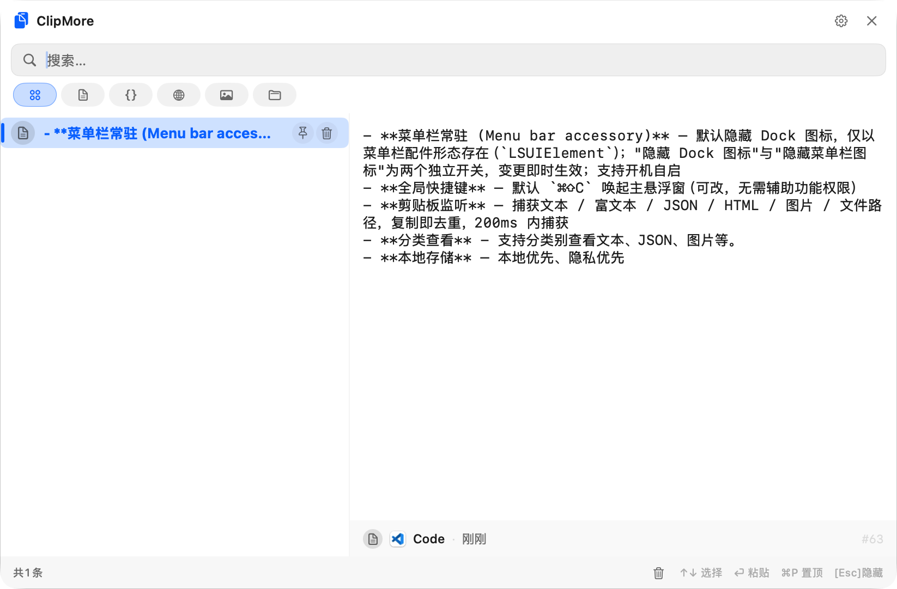
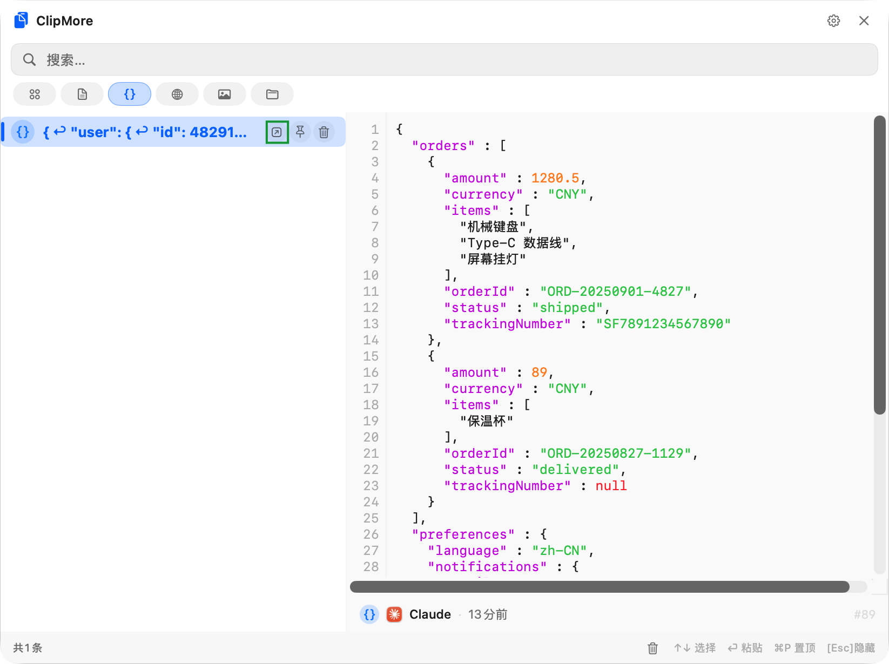
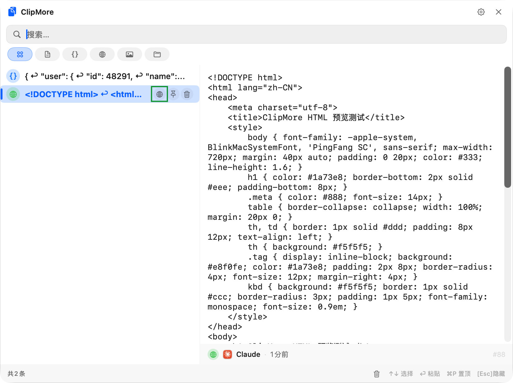
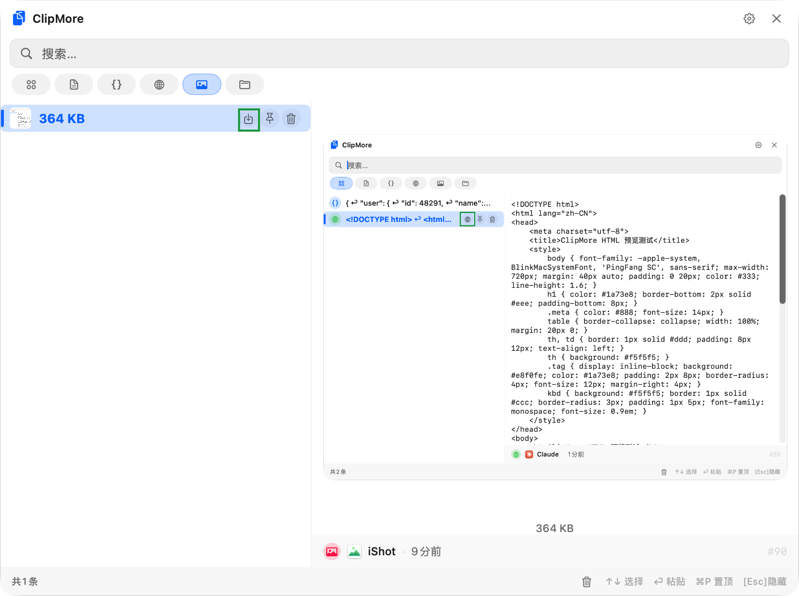

# ClipMore

**极简 macOS 剪贴板工具** — 轻量、极速、多功能，"复制即处理"，菜单栏常驻。要求 macOS 13+。

## Preview

## Features

### 剪贴板核心

- **菜单栏常驻 (Menu bar accessory)** — 默认隐藏 Dock 图标，仅以菜单栏配件形态存在（`LSUIElement`）；"隐藏 Dock 图标"与"隐藏菜单栏图标"为两个独立开关，变更即时生效；支持开机自启
- **全局快捷键** — 默认 `⌘⇧C` 唤起主悬浮窗（可改，无需辅助功能权限）
- **剪贴板监听** — 捕获文本 / 富文本 / JSON / HTML / 图片 / 文件路径，复制即去重，200ms 内捕获
- **分类查看** - 支持分类别查看文本、JSON、图片等。
- **本地存储** — 本地优先、隐私优先

### 三个智能动作（内容类型自动分流）

- **JSON** — 自动识别 → 格式化高亮预览；`⌘J` 打开**多实例独立查看器**，支持搜索高亮（`⌘G`/`⇧⌘G` 循环跳转）、折叠、复制路径、外部工具打开（打开成功后自动关闭）
- **HTML** — 自动识别 → 写入临时文件并在默认浏览器打开；全局快捷键 `⌘⇧H` 可直接在浏览器中打开剪贴板中的 HTML；保留天数可配置（1/7/15/30 天、永久），后台定时清理
- **图片** — 自动识别 → 手动保存（原生保存面板）或按命名模板自动静默保存，模板变量支持 `{date}` `{time}` `{datetime}` `{app}` `{type}` `{n}` `{hash}`

   

### 交互与外观

- **原生 vibrancy 毛玻璃 UI** — 圆角 + 阴影，无黑灰外边框，1pt 细描边作可视边界
- **光标处唤起** — 跟随光标所在屏，全屏 / 多显示器下正确定位，自动翻转 / 贴边避让菜单栏与 Dock
- **模糊搜索** — 全文 + 类型 / 时间过滤，悬浮窗出现后直接输入即聚焦搜索框
- **键盘驱动** — Enter / 双击粘贴、`⌘P` 置顶、Delete 删除、Esc 隐藏、点窗口外自动隐藏
- **焦点归还** — 收起后键盘焦点交还给弹出前的应用，可直接继续输入或粘贴
- **明 / 暗主题** — 跟随系统 / 手动切换，即时生效、跨窗口同步
- **中英文热切换** — 设置页下拉切换，所有 UI 即时响应

## Keyboard Shortcuts

| Key            | Action                    |
| -------------- | ------------------------- |
| `⌘⇧C`          | 显示/隐藏主悬浮窗（默认，可改）          |
| `⌘J`           | 在独立窗口中打开选中的 JSON（可多开）     |
| `⌘⇧H`          | 直接用默认浏览器打开剪贴板中的 HTML      |
| `⌘F`           | JSON 独立窗口中聚焦搜索框           |
| `⌘G` / `⇧⌘G`   | JSON 独立窗口中跳转下一个/上一个匹配（循环） |
| `↑/↓`          | 在列表中上下移动                  |
| `Enter`        | 粘贴选中项并关闭主窗口（还原上下文）        |
| `Esc`          | 隐藏悬浮窗 / 关闭 JSON 查看器       |
| `⌘P`           | 切换置顶                      |
| `Delete` / `⌫` | 删除选中项                     |
| 可打印字符          | 自动聚焦搜索框并输入内容搜索            |
| 点击窗口外          | 自动隐藏主面板                   |

## 请作者喝一杯咖啡

 

